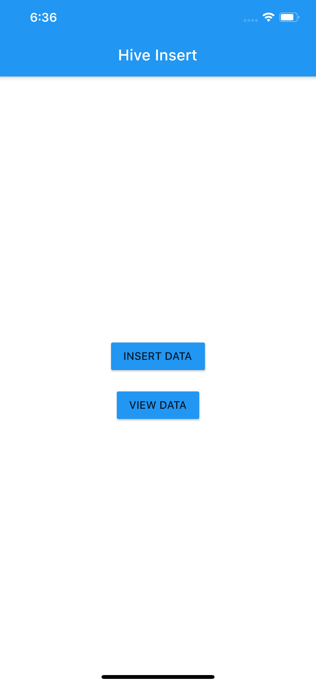

# Flutter Hive Database Example

A new Flutter project to understand to Hive database implementation.

Detail explanation can be found at - [App With Flutter](https://www.appwithflutter.com)

## Packages Used

- [Hive Package](https://pub.dev/packages/hive#-readme-tab-)

## Screenshots
&nbsp;&nbsp;&nbsp;&nbsp;&nbsp;&nbsp;&nbsp;&nbsp;&nbsp;&nbsp;&nbsp;&nbsp;&nbsp;&nbsp;&nbsp;&nbsp;&nbsp;&nbsp;&nbsp;&nbsp;&nbsp;&nbsp;&nbsp;&nbsp;
